# Edusaku — Offline AI for Education

<p align="center">
  
  
  
  
  
  
  
  
  
  
  
</p>

---

**Edusaku** is an offline-first AI education assistant designed for teachers and students in remote areas with limited or no internet access. It runs Google's **Gemma 4 E2B** model entirely on-device — no cloud, no data leaving your hands.

The system consists of two parts that work together:
- A **React Native Android app** — the student/teacher's mobile interface for chatting with documents on-device.
- A **Node.js PC server + React web UI** — a local server that runs on a teacher's PC, handles document uploads, OCR, RAG indexing, and serves a browser-based chat interface.

---

## Table of Contents

- [Overview](#overview)
- [Key Features](#key-features)
- [System Flow](#system-flow)
- [Tech Stack](#tech-stack)
- [Project Structure](#project-structure)
- [Database Schema](#database-schema)
- [Getting Started](#getting-started)
- [Environment Variables](#environment-variables)
- [Future Features](#future-features)
- [Contributing](#contributing)
- [License](#license)
- [Authors](#authors)

---

## Overview

Edusaku addresses a real problem: quality AI-assisted learning tools require internet connectivity, which excludes millions of students in underserved areas. Edusaku solves this by running the entire AI pipeline locally — the LLM, embeddings, vector store, and OCR all run on the user's own hardware.

**Mobile app** — Upload PDFs, ask questions about them, and get AI-generated answers with page citations. Everything runs on the Android device using `llama.rn` with a quantized GGUF model.

**PC server** — Teachers can run a local server on their laptop, upload documents (PDFs or photos), and access a full-featured web chat interface. The mobile app can connect to this server over local Wi-Fi via QR code scan.

---

## Key Features

### Mobile App (Android)
- **On-device LLM inference** — Gemma 4 E2B (Q4 quantized GGUF) runs fully offline via `llama.rn`
- **Document Q&A with RAG** — Upload PDFs, ask questions, get answers with page-level citations
- **On-device vector store** — Embeddings stored in AsyncStorage using cosine similarity search
- **Streaming responses** — Token-by-token output with animated typing indicator
- **AI-generated chat titles** — Session titles auto-generated by the model
- **Camera capture** — Photograph physical documents and send them to the PC server
- **PC connection via QR** — Scan a QR code to connect the mobile app to the local PC server
- **Onboarding flow** — Animated splash screen and intro slides on first launch
- **Dark mode** — Follows system color scheme automatically
- **Persistent state** — Documents, chat history, and sessions survive app restarts via AsyncStorage

### PC Server + Web UI
- **Offline RAG pipeline** — PDF text extraction + Tesseract OCR for images → chunking → MiniLM embeddings → Vectra vector store
- **Gemma 4 via Ollama** — The PC server auto-starts Ollama and serves the `gemma4:e2b` model
- **Streaming responses** — SSE-based token-by-token streaming via `/chat/stream`; users see the answer form in real time
- **Multi-session chat** — Create, rename, delete, pin, and switch between multiple chat sessions
- **Persistent chat history** — All sessions and messages are stored in `localStorage`; data survives page refresh and server restarts
- **Auto-generated session titles** — AI automatically names each session from the first message; title is saved and persists until manually renamed
- **Smart "New Chat"** — Clicking "+ New Chat" reuses an existing empty session instead of creating duplicates
- **Session ordering** — The most recently active session automatically rises to the top of the list (below pinned items)
- **Pin sessions** — Pin any chat session to keep it permanently at the top of the sidebar
- **Document library** — Grid view of all uploaded files with drag-and-drop upload support
- **Orphan chunk cleanup** — On startup, the server automatically removes vector index entries whose source files no longer exist in `uploads/`
- **Storage usage panel** — "Usage" menu in the sidebar shows live storage consumption: document library size, vector index size, chunk count, and total disk usage
- **Markdown rendering** — AI responses rendered with full GFM (tables, code blocks, lists)
- **QR code pairing** — Displays a QR code for instant mobile app connection
- **Search** — Full-text search across documents and chat sessions
- **Dark / light mode** — Persisted theme preference
- **Retry & delete** — Retry last message or delete individual chat sessions
- **Improved system prompt** — Bilingual (Indonesian/English), context-aware, education-focused instructions

---

## System Flow

```mermaid
flowchart TD
    subgraph Mobile["📱 Android App (React Native)"]
        A[User uploads PDF] --> B[PDF text extraction\nreact-native-pdf-lib]
        B --> C[Text chunking\n1000 chars / 200 overlap]
        C --> D[Embedding generation\nGemma 4 via llama.rn]
        D --> E[Vector store\nAsyncStorage cosine similarity]
        F[User asks question] --> G[Embed query\nGemma 4]
        G --> H[Top-K chunk retrieval\nfrom AsyncStorage]
        H --> I[Build RAG prompt\nwith page context]
        I --> J[LLM inference\nGemma 4 E2B GGUF Q4]
        J --> K[Streaming response\nwith page citations]
    end

    subgraph PC["🖥️ PC Server (Node.js + React Web)"]
        L[User uploads file\nPDF or image] --> M{File type?}
        M -->|PDF| N[pdf-parse\ntext extraction]
        M -->|Image| O[Tesseract.js OCR\neng + ind]
        N --> P[Text chunking\n500 chars / 100 overlap]
        O --> P
        P --> Q[MiniLM embeddings\nXenova/all-MiniLM-L6-v2]
        Q --> R[Vectra vector index\nfile-based local store]
        S[User sends chat message] --> T[Embed query\nMiniLM]
        T --> U[Retrieve top-6 chunks\nfrom Vectra]
        U --> V[Build RAG prompt\nwith document context]
        V --> W[Ollama API\ngemma4:e2b]
        W --> X[Response to web UI]
    end

    subgraph Connection["🔗 Mobile ↔ PC Bridge"]
        Y[PC displays QR code\nwith local IP:3000] --> Z[Mobile scans QR\nvia camera]
        Z --> AA[Mobile connects\nover local Wi-Fi]
        AA --> BB[Camera capture\non mobile]
        BB --> CC[Upload image\nto PC server /upload]
    end
```



---

## Tech Stack

| Layer | Technology |
|---|---|
| Mobile framework | React Native 0.76.5 |
| Mobile language | TypeScript 5.6 |
| Mobile navigation | React Navigation 6 |
| Mobile state | Zustand 5 + AsyncStorage |
| On-device LLM | llama.rn 0.12 (Gemma 4 E2B GGUF Q4) |
| Mobile vector store | AsyncStorage (cosine similarity) |
| PDF parsing | react-native-pdf-lib |
| Camera / image picker | react-native-camera-kit, react-native-image-picker |
| PC server runtime | Node.js + Express 4 |
| PC LLM runtime | Ollama (`gemma4:e2b`) |
| PC embeddings | @xenova/transformers (all-MiniLM-L6-v2) |
| PC vector store | Vectra (file-based local index) |
| PC OCR | Tesseract.js 7 (eng + ind) |
| PC PDF parsing | pdf-parse |
| Web UI framework | React 19 + TypeScript |
| Web UI styling | Tailwind CSS 3.4 |
| Web UI markdown | react-markdown + remark-gfm |
| Web UI icons | lucide-react |
| File upload | multer |
| HTTP client | axios |

---

## Project Structure

```
Edusaku/
├── App.tsx                        # Root navigator + theme setup
├── index.js                       # React Native entry point
├── package.json                   # Mobile app dependencies
│
├── src/
│   ├── screens/
│   │   ├── OnboardingScreen.tsx   # Splash + intro slides (first launch)
│   │   ├── HomeScreen.tsx         # Document list + FAB actions
│   │   ├── ChatScreen.tsx         # RAG chat interface with streaming
│   │   ├── ConnectionScreen.tsx   # QR scan / manual IP to connect PC
│   │   ├── CameraScreen.tsx       # Native camera capture
│   │   └── UploadScreen.tsx       # Preview + send image to PC server
│   │
│   ├── services/
│   │   ├── inference.ts           # llama.rn wrapper — load, embed, complete
│   │   ├── embedding.ts           # Text → vector via Gemma 4
│   │   ├── rag.ts                 # Full RAG pipeline (chunk, embed, retrieve, prompt)
│   │   ├── vectorStore.ts         # AsyncStorage vector store + cosine search
│   │   ├── pdfParser.ts           # PDF text extraction
│   │   ├── titleGenerator.ts      # AI-generated session titles
│   │   ├── NetworkService.ts      # PC server ping
│   │   └── UploadService.ts       # Multipart image upload to PC
│   │
│   ├── store/
│   │   └── appStore.ts            # Zustand store (documents, chat, UI state)
│   │
│   ├── db/
│   │   ├── schema.ts              # DB schema definitions
│   │   └── migrations.ts          # DB migrations
│   │
│   ├── components/
│   │   ├── ChatBubble.tsx         # Message bubble (user / assistant)
│   │   ├── DocumentCard.tsx       # Document list item card
│   │   ├── PDFUploader.tsx        # FAB upload button
│   │   └── ProgressBar.tsx        # Reusable progress bar
│   │
│   ├── theme/
│   │   ├── colors.ts              # Light / dark color tokens
│   │   └── typography.ts          # Text style presets
│   │
│   └── utils/
│       └── storage.ts             # AsyncStorage helpers (server URL, etc.)
│
├── server/
│   ├── index.js                   # Express server — routes, Ollama, file handling
│   ├── rag.js                     # Offline RAG pipeline (OCR, embed, Vectra)
│   ├── package.json               # Server dependencies
│   ├── uploads/                   # Uploaded files (PDFs, images)
│   ├── vector_index/              # Vectra persistent vector index
│   └── models/
│       ├── Modelfile              # Ollama model definition
│       └── README.md              # Model download instructions
│
└── server/client/                 # React web UI (served by Express)
    ├── src/
    │   ├── App.tsx                # Main app — sessions, uploads, theme
    │   ├── Sidebar.tsx            # Collapsible sidebar — chats, library, QR
    │   ├── ChatArea.tsx           # Chat messages + input bar
    │   └── Onboarding.tsx         # Web onboarding flow
    ├── tailwind.config.js
    └── package.json               # Web UI dependencies
```

---

## Database Schema

Edusaku uses **AsyncStorage** (mobile) and a **file-based Vectra index** (PC server) — no SQL database is required.

### Mobile — Zustand Persisted Store (`edusaku-store`)

```
Document {
  id          : string (UUID)
  title       : string
  fileName    : string
  filePath    : string        -- local FS path after copy
  sizeBytes   : number
  pageCount   : number
  chunkCount  : number        -- populated after embedding
  embeddedAt  : string | null -- ISO timestamp, null = not yet embedded
  createdAt   : string        -- ISO timestamp
}

ChatMessage {
  id           : string
  role         : 'user' | 'assistant'
  content      : string
  sourceChunks : string[]     -- chunk IDs used for RAG context
  createdAt    : string
}

ChatSession {
  documentId       : string
  messages         : ChatMessage[]
  title            : string        -- AI-generated session title
  titleGeneratedAt : number        -- Unix ms timestamp
}
```

### Mobile — Vector Store (`@edusaku_vectors_{documentId}`)

```
VectorChunk {
  id         : string (UUID)
  documentId : string
  text       : string
  embedding  : number[]       -- float vector from Gemma 4
  metadata {
    pageNumber : number
  }
}
```

### PC Server — Vectra Index (`server/vector_index/`)

```
VectorItem {
  vector   : number[]         -- float vector from all-MiniLM-L6-v2
  metadata {
    filename   : string
    chunkIndex : number
    text       : string
  }
}
```

---

## Getting Started

### Prerequisites

- Node.js 18+
- Android Studio + Android SDK (for mobile)
- Java 17 (for Android build)
- [Ollama](https://ollama.com) installed on the PC
- Gemma 4 E2B GGUF model file (see below)

---

### 1. Clone the repository

```bash
git clone https://github.com/allegrafs066/Edusaku.git
cd Edusaku
```

---

### 2. Mobile App Setup

```bash
# Install dependencies
npm install

# Run on Android (device or emulator)
npm run android
```

The mobile app bundles the Gemma 4 GGUF model as an Android asset. Place the model file at:

```
android/app/src/main/assets/models/gemma4-e2b-q4.gguf
```

Download the Q4_K_M quantized model from [Hugging Face](https://huggingface.co/google/gemma-4-e2b-it-GGUF).

---

### 3. PC Server Setup

```bash
cd server
npm install
```

Pull the Gemma 4 model for Ollama:

```bash
ollama pull gemma4:e2b
```

Start the server:

```bash
npm start
```

The server starts on `http://0.0.0.0:3000`. Open a browser and navigate to `http://localhost:3000` to access the web UI.

---

### 4. Web UI Build (optional, for production)

```bash
cd server/client
npm install
npm run build
```

The built files are served automatically by the Express server.

---

### 5. Connect Mobile to PC

1. Make sure your phone and PC are on the **same Wi-Fi network**.
2. In the mobile app, tap **Connect PC** in the top-right corner.
3. Scan the QR code shown in the web UI sidebar, or enter the PC's IP address manually (port `3000`).

---

## Environment Variables

Edusaku is designed to run fully offline with zero external services. No API keys or cloud credentials are required.

The only configurable values are hardcoded constants you can change directly in the source:

| File | Constant | Default | Description |
|---|---|---|---|
| `src/services/inference.ts` | `N_THREADS` | `4` | CPU threads for on-device inference |
| `src/services/inference.ts` | `MAX_TOKENS` | `512` | Max tokens per LLM response (mobile) |
| `src/services/rag.ts` | `TOP_K_CHUNKS` | `4` | Top-K chunks retrieved per query (mobile) |
| `src/services/rag.ts` | `CHUNK_SIZE` | `1000` | Characters per chunk (mobile) |
| `server/index.js` | `PORT` | `3000` | PC server port |
| `server/index.js` | `OLLAMA_MODEL` | `gemma4:e2b` | Ollama model name |
| `server/rag.js` | `CHUNK_SIZE` | `500` | Characters per chunk (PC server) |
| `server/rag.js` | `CHUNK_OVERLAP` | `100` | Chunk overlap (PC server) |

---

## Future Features

### Mobile Expansion
The current release focuses on the web experience (PC server + browser UI). The next major milestone is expanding the mobile app to reach feature parity:

- **Full PDF upload on mobile** — Native document picker integration with the on-device RAG pipeline
- **Multi-document chat** — Ask questions across multiple uploaded documents simultaneously
- **Offline OCR on mobile** — On-device OCR for photographed documents without needing the PC server
- **Push-to-PC sync** — Automatically sync indexed documents between mobile and PC over local Wi-Fi
- **iOS support** — Extend the React Native app to iOS (currently Android-only)

### Desktop App (Electron)
The PC server + web UI is planned to be packaged as a standalone **Electron desktop application**, eliminating the need to run a terminal and making it accessible to non-technical teachers.

### General
- **Multi-language OCR** — Expand Tesseract language support beyond English and Indonesian
- **Voice input** — Speech-to-text for hands-free question asking
- **Quiz generation** — Auto-generate practice questions from uploaded documents
- **Offline model updates** — Sideload updated model weights without internet

---

## Contributing

Contributions are welcome from anyone who wants to help bring quality AI education tools to underserved communities.

### How to contribute

1. **Fork** the repository
2. **Create a branch** for your feature or fix:
   ```bash
   git checkout -b feat/your-feature-name
   ```
3. **Commit** your changes with a clear message:
   ```bash
   git commit -m "feat: add your feature description"
   ```
4. **Push** to your fork:
   ```bash
   git push origin feat/your-feature-name
   ```
5. **Open a Pull Request** against the `main` branch

### Guidelines

- Follow the existing code style (TypeScript, ESLint config in `package.json`)
- Keep PRs focused — one feature or fix per PR
- Write clear commit messages (we follow [Conventional Commits](https://www.conventionalcommits.org/))
- Test on a real Android device if touching mobile code
- For server changes, test with both PDF and image uploads

### Good first issues

- Improving error messages and user-facing alerts
- Adding more onboarding slides
- Improving the RAG chunking strategy
- Adding unit tests for service functions

---

## License

This project is licensed under the **Apache License 2.0** — see the [LICENSE](./LICENSE) file for details.

---

## Authors

<table>
  <tr>
    <td align="center">
      <a href="https://github.com/allegrafs066">
        <b>Allegra Fernanda Santoso</b><br/>
        <sub>@allegrafs066</sub>
      </a>
    </td>
    <td align="center">
      <a href="https://github.com/yoockh">
        <b>Aisiya Qutwatunnada</b><br/>
        <sub>@yoockh</sub>
      </a>
    </td>
  </tr>
</table>
